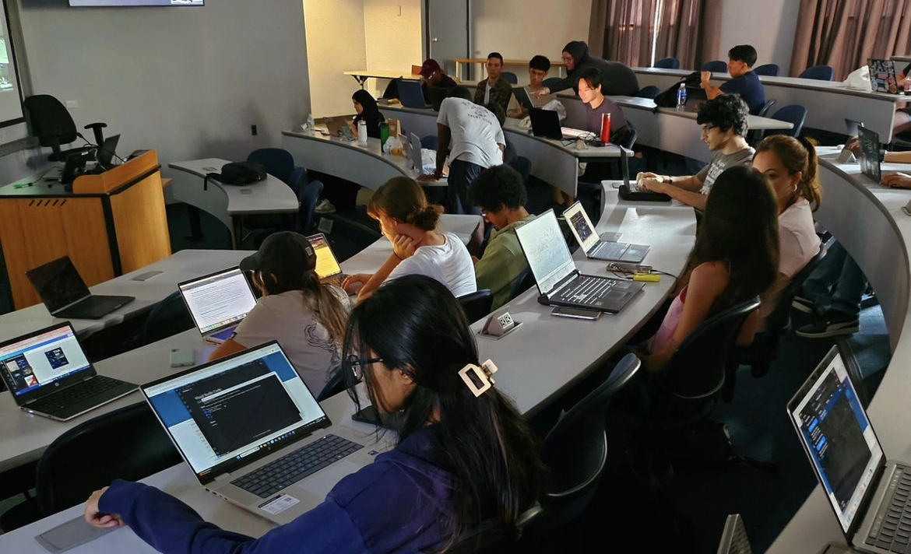

#  🚀 Git & GitHub Workshop: Level Up Your Collaboration

  

The ACM Chapter at Manhattan University hosted a Git and GitHub Workshop to help students learn the basics of version control. The workshop covered:

Topics Covered:
Git Basics: Setting up repositories, making commits, and pushing code.

# basic common git command #

git init 

git status 

git add <file-name>
git add . 

git commit -m "your message"

git push origin main

git push origin <your-branch-name>

git checkout -b <name-of-branch>

git checkout <name-of-branch>

git merge <name-of-branch>

git pull origin 
git pull origin <name-of-branch>

git fetch origin

Version Control: Tracking changes, using branches, and merging code.

GitHub Collaboration: Working with forks, pull requests, and issues for team projects.

Why It’s Useful:

Work Better in Teams: Git allows multiple people to work on the same project without conflicts.

Track Your Code: Easily revert to earlier versions when needed.

Contribute to Open Source: GitHub is the platform for contributing to projects and building a portfolio.

# Missed the event? Check out the slides:

Day 1 Slides 
[Click Here](resources/Git_Github_VCSandIDESeteup.pdf)

Day 2 Slides
[Click Here](resources/Git_Github_VCS.pdf)

Link to the recorded event!
[Click Here](https://youtu.be/rzyb08zh_Yg?si=fLpjlYJVIpp1H_6S)

try using this repository to practice!